<h2> Howdy! I'm Diego Revilla </h2>

<em>Computer Engineering + Data Science and Artificial Inteligence Student at the University of Deusto
</em>

Specially interested in <b>Computer Graphics</b>, <b>Natural Language Processing</b> and <b>Robotics</b>
</em>

 

)
